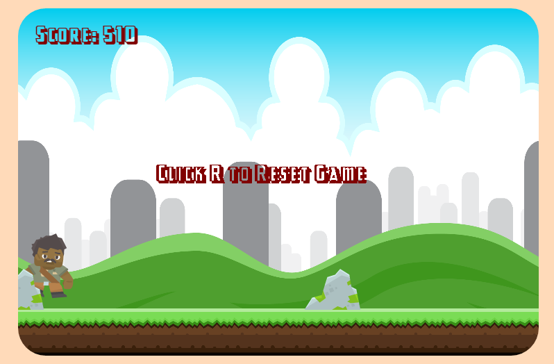

# Chuka Jump

Chuka Has to go to the grocery but he lives in a terrible neighborhood there are rocks everywhere and aliens invaded his neighborhood specifically.




## How To Play

Navigate through the rocks by jumping with `spacebar` and ducking with `down-key`.


# Features

## Scrolling Background

Two pictures back to back and repositioning of the x-coordinate create a continuous smooth flow of game-play and increases addictiveness.

``` javascript
draw(ctx){
  const imageRepository = new function() {
    this.background = new Image();
    this.background.src = "assets/full-background.png";
  };

  ctx.drawImage(
      imageRepository.background,
      this.xPos,
      this.yPos,
      this.width,
      this.height,
      0,
      0,
      750,
      500
    );

    ctx.drawImage(
      imageRepository.background,
      this.xPos - this.width,
      this.yPos,
      this.width,
      this.height,
      0,
      0,
      750,
      500
    );

    this.move();

    if (this.xPos > 3072){
      this.xPos = 0;
    }
}
```
## Collision Detection

Collision detection based on distance creates  simple clean collision detection.

``` javascript
distance(num1,num2){
 var a = (num2[0] - num1[0])
 var b = (num2[1] - num1[1])
 var c = Math.floor(Math.sqrt((Math.pow(a,2)+ Math.pow(b,2))));
 return c

}

checkCollision(){
  if ((this.distance(this.pos,this.game.chuka.pos)) < 60){
      this.game.gameOver();
  }
}
```
## Audio/Music Toggling

Sound can be turn on and off using simple toggle music algorithm.

``` javascript
toggleSound(){
  if(this.songOn && this.clicked){
    this.songOn = false;
    this.clicked = false;
  }

  if(!this.songOn && this.clicked){
     this.songOn = true;
     this.clicked = false;
  }
}

```
